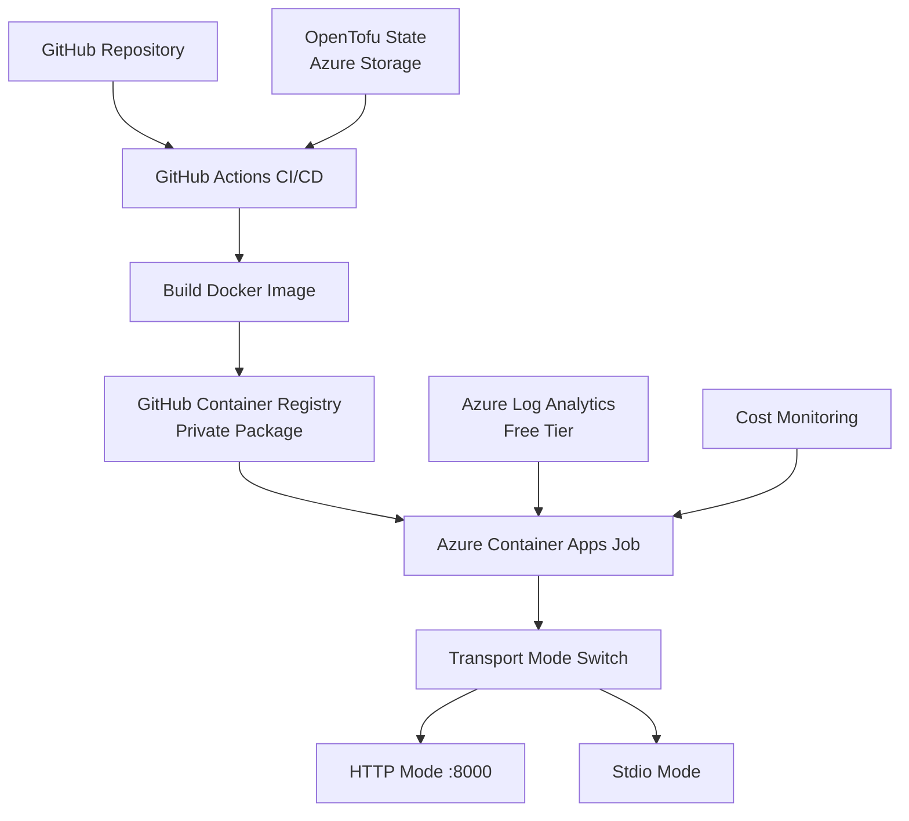

# Azure Container Apps Deployment Guide with OpenTofu

## Overview

This guide provides step-by-step instructions for deploying the PowerPoint MCP Server to Azure Container Apps using OpenTofu (open-source Terraform alternative) and GitHub Actions with cost optimization in mind.

## Architecture



## Cost Structure

### GitHub Container Registry (Private)
- **Storage**: 500MB free, then $0.25/GB per month
- **Bandwidth**: 1GB free per month, then $0.50/GB
- **Authentication**: GitHub token (included)
- **Estimated Cost**: $0-2/month

### Azure Container Apps (Free Tier)
- **vCPU**: 180,000 seconds per month (free)
- **Memory**: 360,000 GiB-seconds per month (free)
- **Requests**: 2 million per month (free)
- **Estimated Cost**: $0/month within limits

### Azure Log Analytics (Free Tier)
- **Data Ingestion**: 5GB per month (free)
- **Retention**: 7 days (free)
- **Estimated Cost**: $0/month

### Azure Storage (OpenTofu State)
- **Storage**: Minimal usage for state files
- **Transactions**: Within free tier
- **Estimated Cost**: $0-1/month

### Total Monthly Cost: $0-3/month

## Prerequisites

1. **Azure Account** with active subscription
2. **GitHub Repository** with Actions enabled
3. **OpenTofu** installed locally (v1.6+)
4. **Azure CLI** installed locally (for initial setup)
5. **Docker** installed locally (for testing)

## Infrastructure as Code Structure

```
infrastructure/
├── main.tf                     # Main configuration
├── variables.tf                # Input variables
├── outputs.tf                  # Output values
├── versions.tf                 # Provider versions
├── backend.tf                  # State backend config
├── terraform.tfvars.example    # Example variables
└── modules/
    ├── state-backend/          # State storage setup
    ├── container-apps-env/     # Container Apps Environment
    ├── container-apps-job/     # Container Apps Job
    └── monitoring/             # Log Analytics
```

## Setup Instructions

### 1. Initial Azure Setup (One-time)

```bash
# Login to Azure
az login

# Get subscription ID
az account show --query id -o tsv

# Create service principal for OpenTofu
az ad sp create-for-rbac \
  --name "opentofu-ppt-mcp" \
  --role contributor \
  --scopes /subscriptions/{subscription-id} \
  --sdk-auth

# Save the output for GitHub secrets
```

### 2. OpenTofu State Backend Setup

First, create the state backend infrastructure:

```hcl
# infrastructure/bootstrap/main.tf
terraform {
  required_version = ">= 1.6"
  required_providers {
    azurerm = {
      source  = "hashicorp/azurerm"
      version = "~> 3.85"
    }
  }
}

provider "azurerm" {
  features {}
}

resource "azurerm_resource_group" "state" {
  name     = "rg-ppt-mcp-tfstate"
  location = "eastus"
}

resource "azurerm_storage_account" "state" {
  name                     = "stpptmcptfstate${random_string.storage_suffix.result}"
  resource_group_name      = azurerm_resource_group.state.name
  location                 = azurerm_resource_group.state.location
  account_tier             = "Standard"
  account_replication_type = "LRS"
  
  blob_properties {
    versioning_enabled = true
  }
}

resource "azurerm_storage_container" "state" {
  name                  = "tfstate"
  storage_account_name  = azurerm_storage_account.state.name
  container_access_type = "private"
}

resource "random_string" "storage_suffix" {
  length  = 8
  special = false
  upper   = false
}

output "storage_account_name" {
  value = azurerm_storage_account.state.name
}
```

Initialize and apply:
```bash
cd infrastructure/bootstrap
tofu init
tofu apply
# Note the storage account name from output
```

### 3. Main Infrastructure Configuration

#### backend.tf
```hcl
terraform {
  backend "azurerm" {
    resource_group_name  = "rg-ppt-mcp-tfstate"
    storage_account_name = "stpptmcptfstate12345678" # From bootstrap output
    container_name       = "tfstate"
    key                  = "ppt-mcp.tfstate"
  }
}
```

#### versions.tf
```hcl
terraform {
  required_version = ">= 1.6"
  
  required_providers {
    azurerm = {
      source  = "hashicorp/azurerm"
      version = "~> 3.85"
    }
    random = {
      source  = "hashicorp/random"
      version = "~> 3.6"
    }
  }
}
```

#### variables.tf
```hcl
variable "location" {
  description = "Azure region for resources"
  type        = string
  default     = "eastus"
}

variable "resource_group_name" {
  description = "Name of the resource group"
  type        = string
  default     = "rg-ppt-mcp"
}

variable "environment_name" {
  description = "Environment name (prod, staging, dev)"
  type        = string
  default     = "prod"
}

variable "github_username" {
  description = "GitHub username for container registry"
  type        = string
}

variable "github_token" {
  description = "GitHub token for container registry access"
  type        = string
  sensitive   = true
}

variable "container_image" {
  description = "Container image to deploy"
  type        = string
  default     = "ghcr.io/yourusername/ppt-mcp-server:latest"
}

variable "transport_mode" {
  description = "Transport mode for the MCP server"
  type        = string
  default     = "http"
  
  validation {
    condition     = contains(["http", "stdio"], var.transport_mode)
    error_message = "Transport mode must be either 'http' or 'stdio'."
  }
}
```

#### main.tf
```hcl
provider "azurerm" {
  features {
    resource_group {
      prevent_deletion_if_contains_resources = false
    }
  }
}

# Resource Group
resource "azurerm_resource_group" "main" {
  name     = var.resource_group_name
  location = var.location
  
  tags = {
    Environment = var.environment_name
    ManagedBy   = "OpenTofu"
    Project     = "ppt-mcp-server"
  }
}

# Log Analytics Workspace
module "monitoring" {
  source = "./modules/monitoring"
  
  resource_group_name = azurerm_resource_group.main.name
  location            = azurerm_resource_group.main.location
  workspace_name      = "ppt-mcp-logs"
  environment         = var.environment_name
}

# Container Apps Environment
module "container_apps_env" {
  source = "./modules/container-apps-env"
  
  resource_group_name        = azurerm_resource_group.main.name
  location                   = azurerm_resource_group.main.location
  environment_name           = "ppt-mcp-env"
  log_analytics_workspace_id = module.monitoring.workspace_id
  log_analytics_primary_key  = module.monitoring.primary_shared_key
  environment                = var.environment_name
}

# Container Apps Job
module "container_apps_job" {
  source = "./modules/container-apps-job"
  
  resource_group_name          = azurerm_resource_group.main.name
  location                     = azurerm_resource_group.main.location
  container_app_environment_id = module.container_apps_env.id
  job_name                     = "ppt-mcp-job"
  container_image              = var.container_image
  github_username              = var.github_username
  github_token                 = var.github_token
  transport_mode               = var.transport_mode
  environment                  = var.environment_name
}
```

#### outputs.tf
```hcl
output "resource_group_name" {
  description = "Name of the resource group"
  value       = azurerm_resource_group.main.name
}

output "container_apps_job_name" {
  description = "Name of the Container Apps Job"
  value       = module.container_apps_job.name
}

output "container_apps_job_id" {
  description = "ID of the Container Apps Job"
  value       = module.container_apps_job.id
}

output "log_analytics_workspace_id" {
  description = "ID of the Log Analytics workspace"
  value       = module.monitoring.workspace_id
}
```

### 4. Module Definitions

#### modules/monitoring/main.tf
```hcl
resource "azurerm_log_analytics_workspace" "main" {
  name                = var.workspace_name
  location            = var.location
  resource_group_name = var.resource_group_name
  sku                 = "PerGB2018"
  retention_in_days   = 7 # Free tier retention
  
  tags = {
    Environment = var.environment
    ManagedBy   = "OpenTofu"
  }
}
```

#### modules/container-apps-env/main.tf
```hcl
resource "azurerm_container_app_environment" "main" {
  name                       = var.environment_name
  location                   = var.location
  resource_group_name        = var.resource_group_name
  log_analytics_workspace_id = var.log_analytics_workspace_id
  
  tags = {
    Environment = var.environment
    ManagedBy   = "OpenTofu"
  }
}
```

#### modules/container-apps-job/main.tf
```hcl
resource "azurerm_container_app_job" "main" {
  name                         = var.job_name
  location                     = var.location
  resource_group_name          = var.resource_group_name
  container_app_environment_id = var.container_app_environment_id
  
  replica_timeout_in_seconds = 300
  replica_retry_limit        = 1
  
  manual_trigger_config {
    parallelism              = 1
    replica_completion_count = 1
  }
  
  template {
    container {
      name   = "ppt-mcp-server"
      image  = var.container_image
      cpu    = 0.25
      memory = "0.5Gi"
      
      env {
        name  = "TRANSPORT_MODE"
        value = var.transport_mode
      }
      
      env {
        name  = "LOG_LEVEL"
        value = "INFO"
      }
      
      env {
        name  = "PPT_TEMPLATE_PATH"
        value = "/app/templates"
      }
      
      dynamic "env" {
        for_each = var.transport_mode == "http" ? [1] : []
        content {
          name  = "HTTP_PORT"
          value = "8000"
        }
      }
    }
  }
  
  registry {
    server               = "ghcr.io"
    username             = var.github_username
    password_secret_name = "github-token"
  }
  
  secret {
    name  = "github-token"
    value = var.github_token
  }
  
  tags = {
    Environment = var.environment
    ManagedBy   = "OpenTofu"
  }
}
```

### 5. GitHub Repository Configuration

#### Required Secrets

Add these secrets to your GitHub repository (`Settings` → `Secrets and variables` → `Actions`):

```yaml
# Azure Service Principal (from step 1)
AZURE_CLIENT_ID: your-client-id
AZURE_CLIENT_SECRET: your-client-secret
AZURE_SUBSCRIPTION_ID: your-subscription-id
AZURE_TENANT_ID: your-tenant-id

# GitHub Token (for container registry)
REGISTRY_TOKEN: ${{ secrets.GITHUB_TOKEN }}

# OpenTofu State Storage
TF_STATE_RESOURCE_GROUP: rg-ppt-mcp-tfstate
TF_STATE_STORAGE_ACCOUNT: stpptmcptfstate12345678
TF_STATE_CONTAINER: tfstate
```

#### GitHub Actions Workflow

Create `.github/workflows/deploy.yml`:

```yaml
name: Deploy to Azure Container Apps

on:
  push:
    branches: [main]
  workflow_dispatch:

env:
  REGISTRY: ghcr.io
  IMAGE_NAME: ${{ github.repository }}

jobs:
  build:
    runs-on: ubuntu-latest
    permissions:
      contents: read
      packages: write
    
    steps:
      - name: Checkout repository
        uses: actions/checkout@v4
      
      - name: Log in to Container Registry
        uses: docker/login-action@v3
        with:
          registry: ${{ env.REGISTRY }}
          username: ${{ github.actor }}
          password: ${{ secrets.GITHUB_TOKEN }}
      
      - name: Build and push Docker image
        uses: docker/build-push-action@v5
        with:
          context: .
          file: ./Dockerfile.enhanced
          push: true
          tags: |
            ${{ env.REGISTRY }}/${{ env.IMAGE_NAME }}:latest
            ${{ env.REGISTRY }}/${{ env.IMAGE_NAME }}:${{ github.sha }}

  deploy:
    needs: build
    runs-on: ubuntu-latest
    environment: production
    
    steps:
      - name: Checkout repository
        uses: actions/checkout@v4
      
      - name: Setup OpenTofu
        uses: opentofu/setup-opentofu@v1
        with:
          tofu_version: 1.6.0
      
      - name: Azure Login
        uses: azure/login@v1
        with:
          creds: |
            {
              "clientId": "${{ secrets.AZURE_CLIENT_ID }}",
              "clientSecret": "${{ secrets.AZURE_CLIENT_SECRET }}",
              "subscriptionId": "${{ secrets.AZURE_SUBSCRIPTION_ID }}",
              "tenantId": "${{ secrets.AZURE_TENANT_ID }}"
            }
      
      - name: Initialize OpenTofu
        working-directory: ./infrastructure
        run: |
          tofu init \
            -backend-config="resource_group_name=${{ secrets.TF_STATE_RESOURCE_GROUP }}" \
            -backend-config="storage_account_name=${{ secrets.TF_STATE_STORAGE_ACCOUNT }}" \
            -backend-config="container_name=${{ secrets.TF_STATE_CONTAINER }}" \
            -backend-config="key=ppt-mcp.tfstate"
      
      - name: Plan OpenTofu Changes
        working-directory: ./infrastructure
        run: |
          tofu plan \
            -var="github_username=${{ github.actor }}" \
            -var="github_token=${{ secrets.GITHUB_TOKEN }}" \
            -var="container_image=${{ env.REGISTRY }}/${{ env.IMAGE_NAME }}:${{ github.sha }}" \
            -out=tfplan
      
      - name: Apply OpenTofu Changes
        if: github.ref == 'refs/heads/main'
        working-directory: ./infrastructure
        run: tofu apply -auto-approve tfplan
```

### 6. Local Development and Testing

#### terraform.tfvars.example
```hcl
location            = "eastus"
resource_group_name = "rg-ppt-mcp"
environment_name    = "prod"
github_username     = "your-github-username"
container_image     = "ghcr.io/your-github-username/ppt-mcp-server:latest"
transport_mode      = "http"
```

#### Local Deployment
```bash
cd infrastructure

# Initialize OpenTofu
tofu init

# Create terraform.tfvars from example
cp terraform.tfvars.example terraform.tfvars
# Edit terraform.tfvars with your values

# Plan deployment
tofu plan

# Apply deployment (manual approval)
tofu apply

# Destroy resources when done
tofu destroy
```

## Transport Mode Configuration

### HTTP Mode
```hcl
# In terraform.tfvars
transport_mode = "http"

# Results in environment variables:
# TRANSPORT_MODE=http
# HTTP_PORT=8000
# LOG_LEVEL=INFO
# PPT_TEMPLATE_PATH=/app/templates
```

### Stdio Mode
```hcl
# In terraform.tfvars
transport_mode = "stdio"

# Results in environment variables:
# TRANSPORT_MODE=stdio
# LOG_LEVEL=INFO
# PPT_TEMPLATE_PATH=/app/templates
```

## Deployment Management

### Manual Job Execution
```bash
# Using Azure CLI
az containerapp job start \
  --name ppt-mcp-job \
  --resource-group rg-ppt-mcp

# Using OpenTofu output
JOB_NAME=$(tofu output -raw container_apps_job_name)
RG_NAME=$(tofu output -raw resource_group_name)
az containerapp job start --name $JOB_NAME --resource-group $RG_NAME
```

### Monitoring and Logs
```bash
# View job execution history
az containerapp job execution list \
  --name ppt-mcp-job \
  --resource-group rg-ppt-mcp \
  --output table

# View logs for specific execution
az containerapp job execution show \
  --name ppt-mcp-job \
  --resource-group rg-ppt-mcp \
  --job-execution-name <execution-name>
```

### State Management
```bash
# View current state
tofu show

# List resources
tofu state list

# Refresh state
tofu refresh

# Import existing resources
tofu import module.monitoring.azurerm_log_analytics_workspace.main /subscriptions/.../resourceGroups/.../providers/Microsoft.OperationalInsights/workspaces/ppt-mcp-logs
```

## Cost Monitoring

### OpenTofu Cost Estimation
```bash
# Preview cost changes before applying
tofu plan -out=tfplan
tofu show -json tfplan | jq '.resource_changes[] | select(.change.actions[] == "create") | .address'
```

### Azure Cost Management
```bash
# Set up budget alerts via OpenTofu
resource "azurerm_consumption_budget_resource_group" "main" {
  name              = "ppt-mcp-budget"
  resource_group_id = azurerm_resource_group.main.id
  amount            = 10
  time_grain        = "Monthly"
  
  time_period {
    start_date = formatdate("YYYY-MM-01'T'00:00:00Z", timestamp())
  }
  
  notification {
    enabled   = true
    threshold = 50
    operator  = "GreaterThan"
    
    contact_emails = ["your-email@example.com"]
  }
}
```

## Rollback and Disaster Recovery

### State Backup
```bash
# Manual state backup
tofu state pull > backup-$(date +%Y%m%d-%H%M%S).tfstate

# Restore from backup
tofu state push backup-20250114-120000.tfstate
```

### Version Rollback
```bash
# Rollback to previous version
tofu plan -var="container_image=ghcr.io/username/ppt-mcp-server:previous-sha"
tofu apply
```

### Emergency Destroy
```bash
# Remove all resources
tofu destroy -auto-approve

# Force removal if state is corrupted
az group delete --name rg-ppt-mcp --yes --no-wait
```

## Security Best Practices

1. **State File Security**
   - Enable encryption at rest for state storage
   - Use versioning for state recovery
   - Restrict access to state storage account

2. **Secret Management**
   - Use GitHub Secrets for sensitive values
   - Never commit secrets to repository
   - Rotate credentials regularly

3. **Access Control**
   - Use least-privilege service principals
   - Enable Azure AD authentication
   - Audit access logs regularly

4. **Infrastructure Security**
   - Keep OpenTofu and providers updated
   - Use resource locks for production
   - Enable diagnostic logging

## Troubleshooting

### Common Issues

#### State Lock Errors
```bash
# Force unlock (use with caution)
tofu force-unlock <lock-id>
```

#### Provider Authentication
```bash
# Verify Azure credentials
az account show

# Re-authenticate
az login
```

#### Module Errors
```bash
# Re-download modules
tofu get -update

# Validate configuration
tofu validate
```

### Debug Mode
```bash
# Enable detailed logging
export TF_LOG=DEBUG
tofu plan
```

## Migration from Azure CLI

To migrate existing resources created with Azure CLI:

1. Import existing resources:
```bash
# Import resource group
tofu import azurerm_resource_group.main /subscriptions/{sub-id}/resourceGroups/rg-ppt-mcp

# Import other resources similarly
```

2. Verify imported state:
```bash
tofu plan
# Should show no changes if import successful
```

## Future Enhancements

When ready to scale beyond free tier:

1. **Multi-Environment Support**
   - Add staging/dev environments
   - Use workspaces for environment isolation

2. **Advanced Monitoring**
   - Add Application Insights module
   - Implement custom metrics

3. **Auto-scaling Configuration**
   - Convert to Container Apps (not Jobs)
   - Add scaling rules

4. **Enhanced Security**
   - Implement Azure Key Vault
   - Add managed identities

---

*This deployment guide uses OpenTofu for infrastructure as code, providing version control, reproducibility, and collaborative infrastructure management while maintaining cost optimization within Azure free tier limits.*