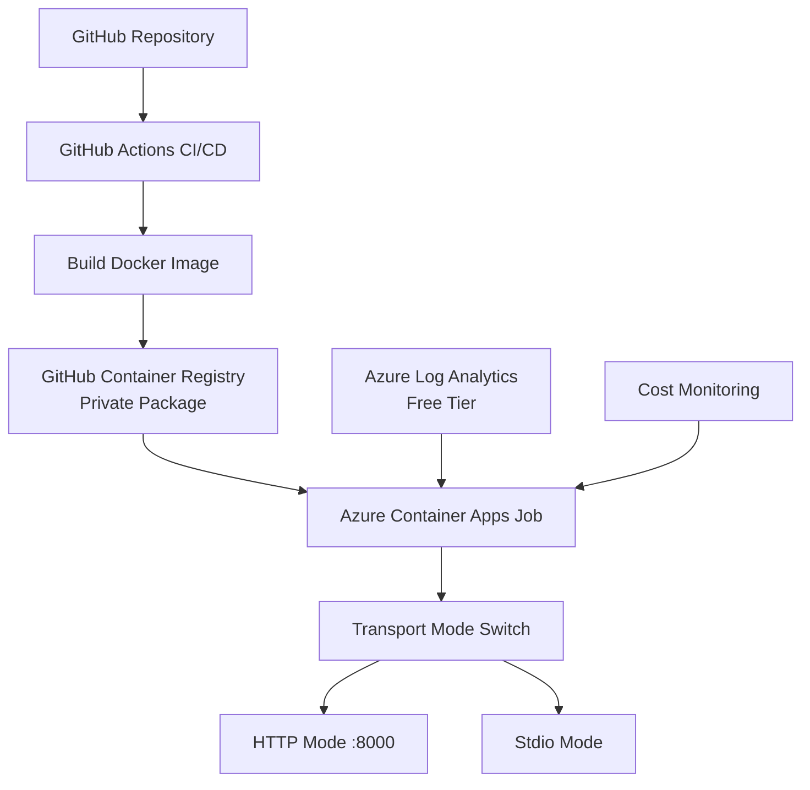

# Azure Container Apps Deployment Guide

## Overview

This guide provides step-by-step instructions for deploying the PowerPoint MCP Server to Azure Container Apps using GitHub Actions with cost optimization in mind.

## Architecture



## Cost Structure

### GitHub Container Registry (Private)
- **Storage**: 500MB free, then $0.25/GB per month
- **Bandwidth**: 1GB free per month, then $0.50/GB
- **Authentication**: GitHub token (included)
- **Estimated Cost**: $0-2/month

### Azure Container Apps (Free Tier)
- **vCPU**: 180,000 seconds per month (free)
- **Memory**: 360,000 GiB-seconds per month (free)
- **Requests**: 2 million per month (free)
- **Estimated Cost**: $0/month within limits

### Azure Log Analytics (Free Tier)
- **Data Ingestion**: 5GB per month (free)
- **Retention**: 7 days (free)
- **Estimated Cost**: $0/month

### Total Monthly Cost: $0-2/month

## Prerequisites

1. **Azure Account** with active subscription
2. **GitHub Repository** with Actions enabled
3. **Azure CLI** installed locally
4. **Docker** installed locally (for testing)

## Setup Instructions

### 1. Azure Infrastructure Setup

```bash
# Login to Azure
az login

# Create resource group
az group create \
  --name rg-ppt-mcp \
  --location eastus

# Create Log Analytics workspace
az monitor log-analytics workspace create \
  --resource-group rg-ppt-mcp \
  --workspace-name ppt-mcp-logs \
  --location eastus

# Create Container Apps environment
az containerapp env create \
  --name ppt-mcp-env \
  --resource-group rg-ppt-mcp \
  --location eastus \
  --logs-workspace-id $(az monitor log-analytics workspace show \
    --resource-group rg-ppt-mcp \
    --workspace-name ppt-mcp-logs \
    --query customerId -o tsv) \
  --logs-workspace-key $(az monitor log-analytics workspace get-shared-keys \
    --resource-group rg-ppt-mcp \
    --workspace-name ppt-mcp-logs \
    --query primarySharedKey -o tsv)
```

### 2. Service Principal Setup

```bash
# Create service principal for GitHub Actions
az ad sp create-for-rbac \
  --name "github-actions-ppt-mcp" \
  --role contributor \
  --scopes /subscriptions/{subscription-id}/resourceGroups/rg-ppt-mcp \
  --sdk-auth

# Copy the JSON output for GitHub secrets
```

### 3. GitHub Repository Configuration

#### Required Secrets

Add these secrets to your GitHub repository (`Settings` → `Secrets and variables` → `Actions`):

```yaml
AZURE_CREDENTIALS: |
  {
    "clientId": "your-client-id",
    "clientSecret": "your-client-secret",
    "subscriptionId": "your-subscription-id",
    "tenantId": "your-tenant-id"
  }

# GITHUB_TOKEN is automatically available
```

#### Repository Variables

```yaml
AZURE_RESOURCE_GROUP: rg-ppt-mcp
AZURE_CONTAINER_ENV: ppt-mcp-env
CONTAINER_APP_NAME: ppt-mcp-server
```

### 4. Container Apps Job Creation

```bash
# Create Container Apps Job
az containerapp job create \
  --name ppt-mcp-job \
  --resource-group rg-ppt-mcp \
  --environment ppt-mcp-env \
  --trigger-type Manual \
  --replica-timeout 300 \
  --replica-retry-limit 1 \
  --replica-completion-count 1 \
  --parallelism 1 \
  --image ghcr.io/yourusername/ppt-mcp-server:latest \
  --cpu 0.25 \
  --memory 0.5Gi \
  --env-vars TRANSPORT_MODE=stdio LOG_LEVEL=INFO \
  --registry-server ghcr.io \
  --registry-username yourusername \
  --registry-password-secret-ref github-token
```

## Transport Mode Configuration

### HTTP Mode
```yaml
Environment Variables:
  TRANSPORT_MODE: http
  HTTP_PORT: 8000
  LOG_LEVEL: INFO
  PPT_TEMPLATE_PATH: /app/templates

Resource Allocation:
  CPU: 0.25 cores
  Memory: 0.5 GB
  Ingress: External (port 8000)
```

### Stdio Mode
```yaml
Environment Variables:
  TRANSPORT_MODE: stdio
  LOG_LEVEL: INFO
  PPT_TEMPLATE_PATH: /app/templates

Resource Allocation:
  CPU: 0.25 cores
  Memory: 0.5 GB
  Ingress: Disabled
```

## Deployment Process

### Automatic Deployment (GitHub Actions)

1. **Push to main branch** triggers the workflow
2. **Build Docker image** using GitHub Actions
3. **Push to GitHub Container Registry** (private)
4. **Deploy to Azure Container Apps** Job
5. **Verify deployment** through logs

### Manual Deployment

```bash
# Trigger job manually
az containerapp job start \
  --name ppt-mcp-job \
  --resource-group rg-ppt-mcp
```

## Monitoring and Troubleshooting

### View Logs
```bash
# View Container Apps logs
az containerapp logs show \
  --name ppt-mcp-job \
  --resource-group rg-ppt-mcp \
  --follow

# View job execution history
az containerapp job execution list \
  --name ppt-mcp-job \
  --resource-group rg-ppt-mcp
```

### Cost Monitoring
```bash
# Check current month usage
az consumption usage list \
  --start-date 2025-01-01 \
  --end-date 2025-01-31 \
  --query "[?contains(instanceName, 'ppt-mcp')]"

# Set up cost alerts
az consumption budget create \
  --budget-name ppt-mcp-budget \
  --amount 10 \
  --time-grain Monthly \
  --time-period startDate=2025-01-01 \
  --notifications enabled=true thresholdType=Actual threshold=5
```

## Testing

### HTTP Mode Testing
```bash
# Test HTTP endpoint
curl -X POST http://your-container-app-url/health

# Test MCP tool
curl -X POST http://your-container-app-url/mcp \
  -H "Content-Type: application/json" \
  -d '{"tool": "create_presentation", "args": {}}'
```

### Stdio Mode Testing
```bash
# Execute job and check logs
az containerapp job start \
  --name ppt-mcp-job \
  --resource-group rg-ppt-mcp

# Follow execution logs
az containerapp job execution list \
  --name ppt-mcp-job \
  --resource-group rg-ppt-mcp \
  --output table
```

## Optimization Tips

### Cost Optimization
1. **Monitor usage** regularly through Azure Cost Management
2. **Use Container Apps Jobs** for on-demand execution
3. **Minimize resource allocation** to stay within free tier
4. **Clean up unused resources** periodically

### Performance Optimization
1. **Use image caching** in GitHub Actions
2. **Optimize Docker image** size using multi-stage builds
3. **Monitor execution times** and adjust timeouts
4. **Use appropriate CPU/memory ratios**

### Security Best Practices
1. **Keep images private** in GitHub Container Registry
2. **Use managed identities** where possible
3. **Regularly update** base images and dependencies
4. **Monitor for vulnerabilities** in container images

## Troubleshooting Common Issues

### Authentication Errors
- Verify GitHub token permissions
- Check Azure service principal roles
- Ensure secrets are correctly configured

### Deployment Failures
- Check GitHub Actions logs
- Verify Docker image builds successfully
- Confirm Azure resource exists and is accessible

### Runtime Errors
- Check Container Apps logs
- Verify environment variables
- Test Docker image locally first

### Cost Overruns
- Monitor usage in Azure Cost Management
- Check for unexpected resource scaling
- Review Container Apps execution frequency

## Future Enhancements

When ready to scale beyond free tier:

1. **Always-on Container Apps** for HTTP mode
2. **Auto-scaling** based on CPU/memory usage
3. **Multiple environments** (dev, staging, prod)
4. **Advanced monitoring** with Application Insights
5. **Custom domains** and SSL certificates
6. **Blue-green deployments** for zero downtime

## Support

For issues related to:
- **Azure Container Apps**: Check Azure documentation
- **GitHub Actions**: Check workflow logs and GitHub docs
- **PowerPoint MCP Server**: Check application logs and README

---

*This deployment guide is optimized for cost-effective usage within Azure free tier limits while maintaining production-ready functionality.*